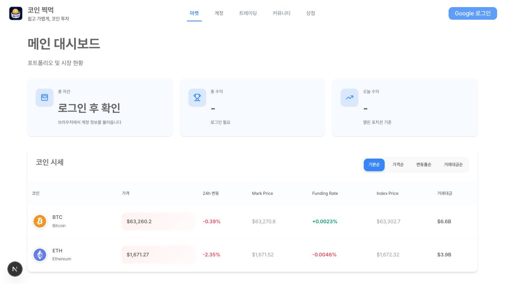
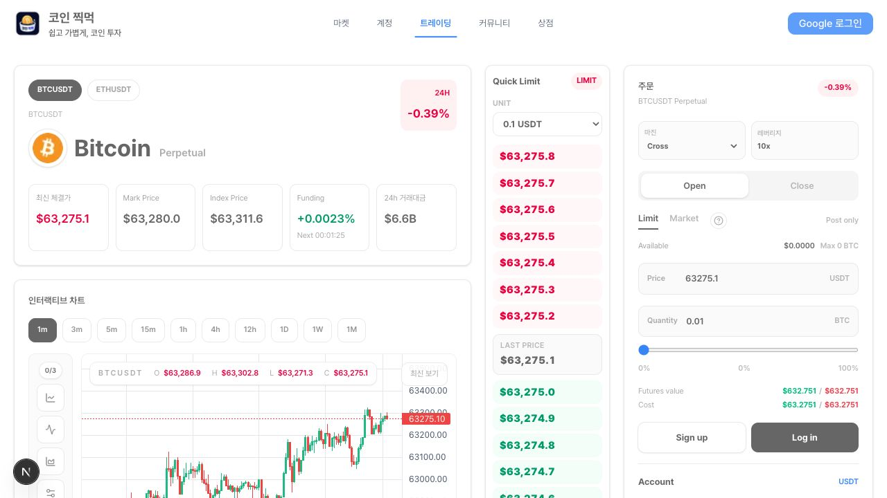

# coin-zzickmock

`coin-zzickmock`는 Bitget 선물 시장 데이터를 바탕으로 가상 USDT 선물 거래를 시뮬레이션하는 데스크톱 우선 서비스입니다.
주문, 포지션, 손익, 청산가, 리워드 흐름을 실제 거래소 주문 전송 없이 프로젝트 내부 규칙으로 처리합니다.

실제 자산 수탁, 실주문 전송, 현금 입출금은 범위에 포함하지 않습니다. 시장 데이터는 Bitget 데이터를 사용할 수 있지만, 주문 체결과 손익 반영은 프로젝트의 모의투자 규칙을 따릅니다.

- 서비스 URL: [https://coin-zzickmock-frontend.vercel.app](https://coin-zzickmock-frontend.vercel.app)

## 화면





## 핵심 구현

- 선물 거래 도메인을 주문, 포지션, 계정, 리워드 기능으로 나누고, 각 기능의 상태 전이와 계산 규칙을 분리했습니다.
- 실시간 가격, 캔들, SSE, Redis, DB 저장소가 섞이는 흐름에서 거래 판단용 데이터와 조회/표시용 데이터를 구분합니다.
- Spring Boot multi-project 구조를 `core`, `app`, `stream`, `storage`, `external`로 나누고, 도메인 규칙과 기술 어댑터가 섞이지 않도록 아키텍처 린트로 일부를 검증합니다.
- 로컬 Compose와 CI를 통해 실행과 검증 흐름을 함께 다룹니다.

## 프로젝트 기능

- 회원가입/로그인과 계정별 초기 가상 잔고 `100000 USDT`
- `BTCUSDT`, `ETHUSDT` 중심의 코인 선물 마켓 목록과 심볼 상세
- 실시간 가격/SSE, 캔들, 시장 지표, 관심 심볼
- 시장가/지정가 주문, 롱/숏 포지션, 격리/교차 마진, 최대 `50x` 레버리지
- 주문 미리보기, 미체결 주문 수정/취소, 주문/체결/포지션/지갑 히스토리
- 포지션 TP/SL 조건부 종료 주문
- 마이페이지, 자산/포인트/교환 내역, 포인트 상점
- 관리자 상점 아이템과 리워드 교환권 처리
- 읽기 전용 수익률 리더보드와 운영 관측성 스택

## 기술 스택

- Frontend: Next.js 15, React 19, TypeScript, Tailwind CSS 4, React Query, Zustand, MSW
- Backend: Spring Boot 3.5, Java 17, Spring Data JPA, QueryDSL, Flyway, Spring Cache, Redis, MySQL, H2 tests, Actuator,
  Micrometer
- Infra: Docker Compose, Nginx, Redis, MySQL, GitHub Actions
- Workspace: npm workspace for `frontend/`, Gradle wrapper for `backend/`

## 프로젝트 구조

루트는 실행과 문서의 입구이고, 실제 사용자 경험은 `frontend/`, 도메인 규칙과 데이터 일관성은 `backend/`가 담당합니다.

```text
coin-zzickmock/
├── frontend/                  # 현재 사용자 경험을 담당하는 Next.js 앱
├── backend/                   # Gradle multi-project backend; app/ is the Spring Boot API/SSE runtime
├── docs/
│   ├── product-specs/         # 제품 동작, 사용자 흐름, 계산 규칙
│   ├── design-docs/           # 백엔드/UI 설계 기준
│   └── generated/             # 현재 DB schema 같은 생성 산출물
├── infra/                     # Nginx, Prometheus, Grafana, Loki, Promtail 설정
├── docker-compose.yml              # 로컬 backend + DB/cache + 관측성 스택
└── README.md
```

## 빠른 실행

### 프론트엔드

루트에서 실행합니다.

```bash
npm install
npm run dev
```

- 기본 개발 서버: `http://localhost:3000`
- 백엔드 API를 목킹해야 하면 `NEXT_PUBLIC_API_MOCKING=enabled`를 사용합니다.

주요 명령어:

```bash
npm run build
npm run start
npm run lint
npm test --workspace frontend
```

### 로컬 백엔드 전체 스택

루트에서 백엔드, MySQL, Redis, Nginx, Prometheus, Grafana, Loki를 함께 실행합니다.

```bash
docker compose up --build
```

백그라운드 실행:

```bash
docker compose up --build -d
```

로컬 Compose는 backend Dockerfile의 `source-runtime` target을 사용하므로 Docker build 안에서 JAR를 만듭니다.

정리:

```bash
docker compose down
```

주요 URL:

- Backend health via Nginx: `http://localhost/actuator/health`
- Prometheus: `http://localhost:9090`
- Grafana via Nginx: `http://localhost/grafana/` (`admin` / `admin`)
- Grafana direct local port: `http://localhost:3001/grafana/`
- Loki API: `http://localhost:3100`

자세한 기준은 [docs/release-docs/observability/local-infra-stack.md](docs/release-docs/observability/local-infra-stack.md)를
참고합니다.

### 백엔드 단독 실행

백엔드를 직접 띄울 때는 먼저 로컬 MySQL/Redis가 필요합니다. Compose로 의존성만 띄운 뒤 Gradle로 실행할 수 있습니다.

```bash
docker compose up -d mysql redis
cd backend
./gradlew :app:bootRun
```

- 직접 실행 시 기본 backend URL: `http://localhost:8080`
- 기본 DB: `jdbc:mysql://localhost:3306/coin_zzickmock`
- 기본 Redis: `localhost:6379`
- 기본 JWT secret과 로컬 DB 비밀번호는 `backend/app/src/main/resources/application.yml`의 개발용 기본값을 사용합니다.

## 검증 명령

프론트:

```bash
npm run lint
npm run build
npm test --workspace frontend
```

백엔드:

```bash
cd backend
./gradlew architectureLint --console=plain
./gradlew check --console=plain
```

CI는 프론트 typecheck/build와 백엔드 `./gradlew check :app:bootJar`를 검증합니다.
